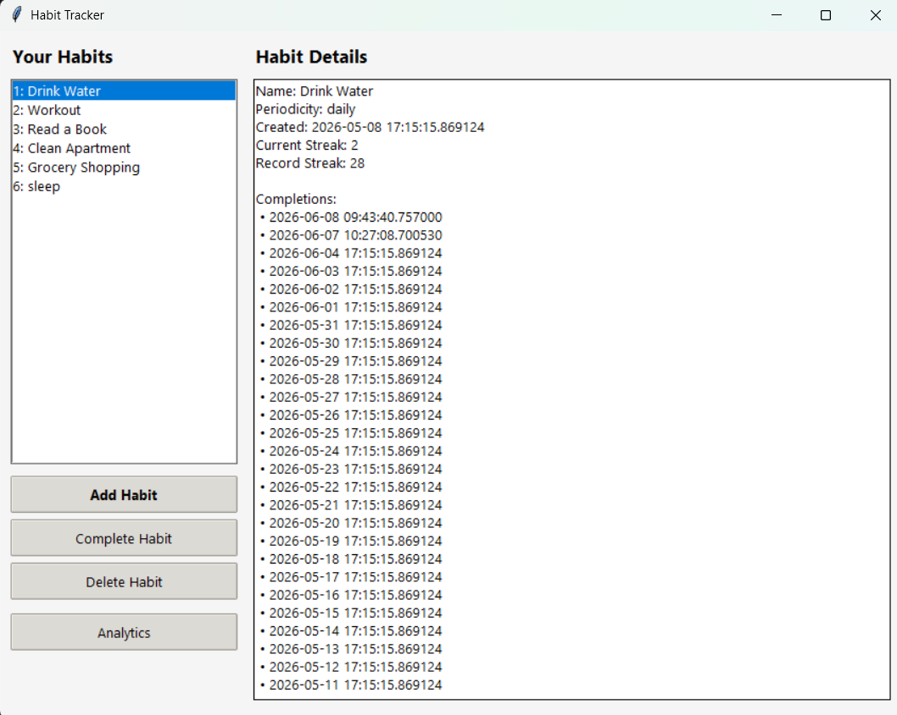
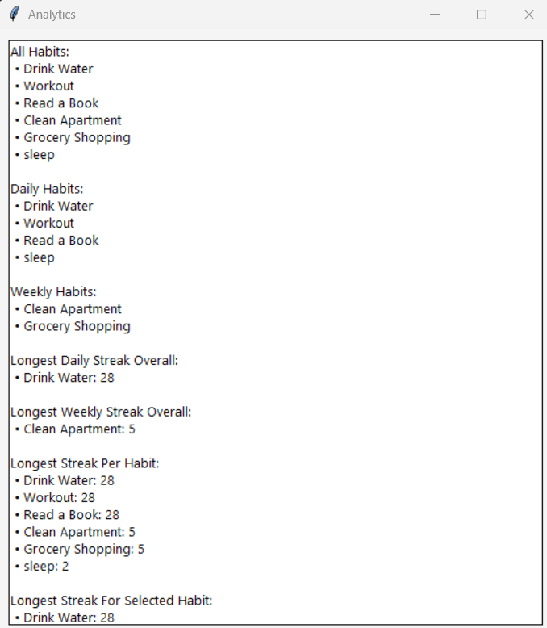
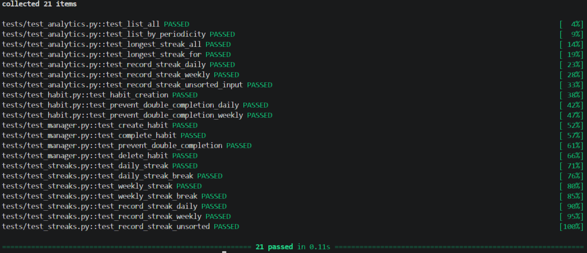

# Habit Tracking Application

## Overview
This project is a modular, maintainable, and testable Habit Tracking Application built in Python.  
It allows users to:

- Create daily or weekly habits
- Complete habits (with validation to prevent double completion)
- Track streaks over time
- View analytics using pure functional programming
- Store all data persistently using SQLite
- Interact through a clean Tkinter GUI

The system follows a clear separation of concerns:

- OOP → Habit model  
- Controller layer → HabitManager  
- SQLite → Persistent storage  
- Functional programming → Analytics  
- Tkinter → User interface  

---

## Project Structure

habit_tracker/
│
├── habit.py
├── manager.py
├── requirements.txt
├── __init__.py
├── storage.py
├── analytics.py
├── ui.py
├── fixtures.py
├── main.py
├── README.md
└── tests/
    ├── test_habit.py
    ├── test_manager.py
    ├── test_analytics.py
    └── test_streaks.py

---

## Installation

### 1. Clone the repository

git clone <https://github.com/elieassaf33/habit_app>

### 2. Requirements
The project uses Python’s built‑in modules:

- sqlite3
- tkinter
- datetime

Only one needed external installation:
- pytest

### 3. Run the application

python main.py

---

## Core Components

### 1. Habit Class (OOP)
Represents a single habit with:

- id  
- name  
- periodicity (daily/weekly)  
- created_at  
- completions (timestamps)  

Includes logic for:

- Completing a habit  
- Preventing double completion (same day/week)  
- Calculating streaks correctly  
- Reconstructing from database rows  

---

### 2. HabitManager (Controller Layer)
Coordinates:

- Creating habits  
- Deleting habits  
- Completing habits  
- Loading habits from SQLite  
- Passing data to analytics  
- Providing habits to the UI  

The UI never interacts with the database directly.

---

### 3. SQLite Storage Layer
Two tables:

- habits(id, name, periodicity, created_at)
- completions(id, habit_id, completed_at)

Provides:

- insert_habit()
- delete_habit()
- insert_completion()
- fetch_habits()
- fetch_completions()

SQLite is chosen because it is:

- Built into Python
- ACID‑compliant
- Reliable for multi‑table data
- More robust than JSON

---

### 4. Analytics (Functional Programming)
Pure functions:

- list_all(habits)
- list_by_periodicity(habits, periodicity)
- longest_streak_all(habits)
- longest_streak_for(habits, name)

These functions:

- Have no side effects
- Do not modify state
- Do not access storage
- Are fully testable

---

### 5. Tkinter GUI
A clean, professional interface:

- Left panel: habit list
- Right panel: habit details
- Buttons: Add, Complete, Delete, Analytics

The Analytics window displays:

- All habits
- Daily habits
- Weekly habits
- Longest daily streak overall
- Longest weekly streak overall
- Longest streak per habit
- Longest streak for selected habit

---

## Fixtures (Sample Data)
On first launch, the app loads:

- 5 predefined habits
- 4 weeks of completion data

This ensures analytics work immediately.

---

## Streak Logic

### Daily habits
A streak increases if the habit is completed once per calendar day.  
Missing a day resets the streak.

### Weekly habits
A streak increases if the habit is completed once per ISO calendar week.  
Missing a week resets the streak.

Double completion in the same day/week is blocked.

---
## Screenshots

### Main UI

### Analytics

### Tests

## Testing
The architecture supports easy unit testing:

- Habit streak logic
- Analytics functions
- HabitManager operations

Run:

python -m pytest -vv

The tests will run

---

## Running the App
Run:

python main.py

The GUI will open automatically.

---

## License
This project is created for academic purposes for IU International University of Applied Sciences.
